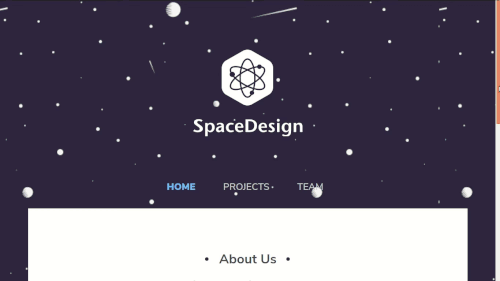

# Space Design Company Website #

This is a demonstration of my HTML &amp; CSS skills, particularly at converting a design file into usable HTML &amp; CSS.

  

## Installation ##

1. Clone this repository (`git clone https://github.com/johnisom/space-design`)
2. `cd` into the repository (`cd space-design`)
3. Open `home.html` in your favorite web browser
4. Enjoy looking at the cool site
